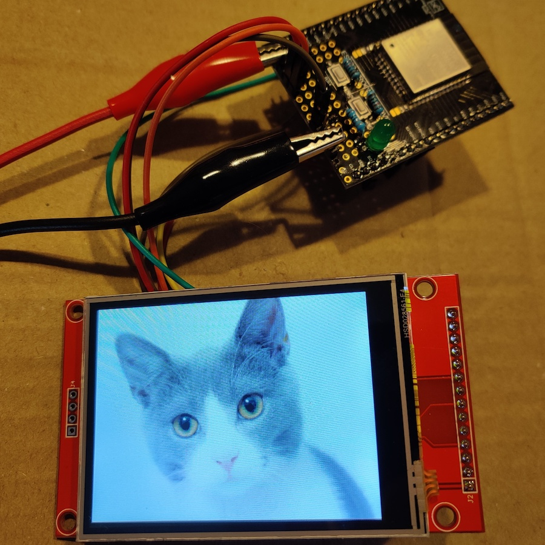

# PlatformIO example for tinyPNG (esp32 and native)

Example for https://github.com/olliiiver/tinyPNG

This example can run in two different environments.

## Native

Run on your local machine (Mac). opencv and pkg-config need to be installed (via brew).

```
pio run
.pio/build/native/program
```

## ESP32

Run on ESP32. Shows an image on an ILI9341 display.

```
pio run --target upload
```


